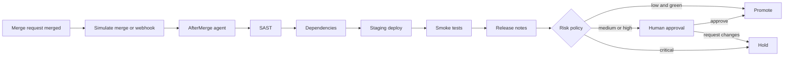

# AfterMerge

AfterMerge is an agentic DevSecOps console for **Northline Mechanical**, a fictional field-service company, and its product **FieldClear** (dispatch, closeout, timeclock, and EPA 608 compliance for mechanical contractors).

When a merge request lands, an agent owns the life after the code: security scan, dependency audit, staging deploy, smoke tests, release notes, a human approval gate, and production promote. The demo is fully simulated. No GitLab token and no paid API.

Built for GitLab's Life After Code (Transcend) hackathon.

**Author:** Cubiczan / Sam Desigan · sam@cubiczan.com

## Life After Code

Life After Code is the stretch of work that starts when the diff is already merged: prove it is safe, put it on staging, see if the product still behaves, tell the people who operate it, and only then ship. AfterMerge puts an agent on that stretch.

The agent does not rubber-stamp green checks. On the live merge it waives a token-prefix log only after it checks production log level, files a follow-up, and refuses to auto-promote. It waives a high dependency advisory only after a call-path check. It retries one flaky smoke. Medium risk stops at a person. A critical, reachable advisory on an older run never leaves the dependency stage.

## Path A

This is a **new repo and a new demo**. It does not wrap an existing product, GitLab project, or customer tenant. Northline Mechanical and FieldClear are fiction used so the post-merge decisions have a workplace: certs, photos, payroll timestamps, refrigerant logs.

## Stages

| Stage | What the agent does in the demo |
| --- | --- |
| SAST | Semgrep with a GitLab SAST-style ruleset. Waive, file, or hold. |
| Dependencies | Gemnasium and `npm audit`. Reachability decides hold vs waiver. |
| Staging deploy | GitLab environment deploy plus a health check. |
| Smoke tests | Playwright. One retry on a 429 from a portal mock. |
| Release notes | Draft for field ops, including waivers. |
| Human approval | Required at medium or high risk. Low risk may auto-promote. |
| Promote | Production only after the gate. Critical findings never get here. |

The board already contains promoted, waiting, and held runs so the policy is visible before you press Simulate merge.

## Run it

```bash
npm install
npm run dev
```

Open the board at [http://localhost:3000](http://localhost:3000). Production build:

```bash
npm run build
npm start
```

Nothing in the loop calls the network. Findings use `DEMO-` ids so they are not real CVEs.

## Record the demo

[/demo](http://localhost:3000/demo) is the ~3 minute screen-record route. The shot list, narration, and the one click you make are in [docs/DEMO.md](docs/DEMO.md).

1. Press **Start 3-minute demo**.
2. Leave the narration on screen. It walks the board, then a live merge on `fieldclear/compliance-portal`.
3. When the approval gate appears (~2:16), click **Approve promote**.
4. The close card states the Path A / Life After Code point. Stop around 3:00.

The recording is not in the tree yet. After the take, commit it at **`docs/aftermerge-demo.mp4`**. Git LFS is already tracking that path (`.gitattributes`). Until that file exists, use `/demo` as the live walkthrough.

You can also drive it yourself from the board with **Simulate merge**, then open any historical run to compare a hold, a waiver, and an auto-promote.

## Architecture



Detail, the GitLab webhook mapping, and a sample pipeline are in [docs/architecture.md](docs/architecture.md).

## Stack

Next.js App Router, TypeScript, Tailwind CSS, shadcn/ui. State lives in the browser. Vercel can host the UI as a static-feeling app; the player does not need a server secret.

## License

[MIT](LICENSE) © 2026 Cubiczan / Sam Desigan
