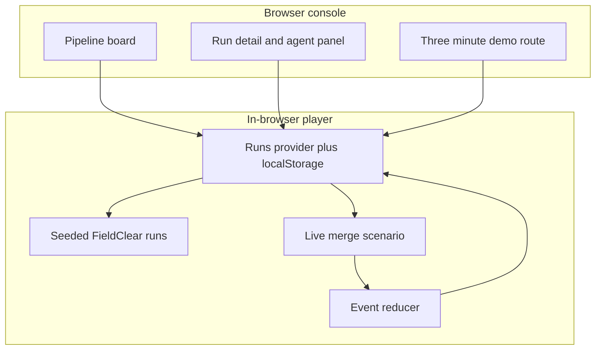
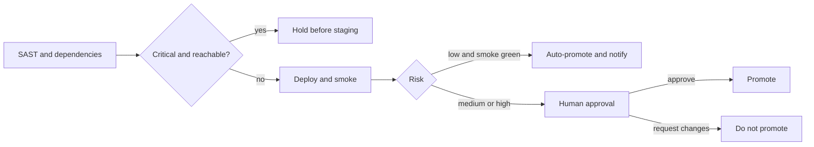
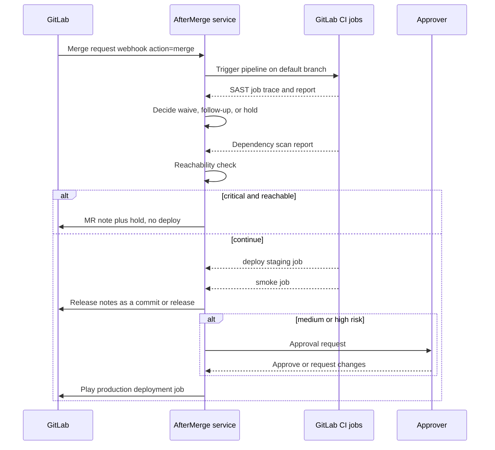

# AfterMerge architecture

AfterMerge is a post-merge agent console. The hackathon build runs entirely in the browser. A later plug-in replaces the player with GitLab webhooks and CI job APIs. The stage model stays the same.

Northline Mechanical and FieldClear are fictional. Advisory ids are prefixed `DEMO-` and are not real vulnerabilities.

## In the demo



`Simulate merge` creates a run and plays timed events: log lines, tool calls, stage status, and the run-level decision. The player stops at the approval gate. Approve plays the promote events. Request changes marks the run rejected and skips promote.

Reloading the page does not resume an in-flight stage. A run left in `running` is marked held so the board does not pretend a dead timer is still working.

## Policy



The seeded board shows all three outcomes:

- `AM-1841` low risk, auto-promoted
- `AM-1840` medium risk, waiting on Dana Okonkwo
- `AM-1838` critical reachable dependency, held before staging
- `AM-1836` medium risk, human-approved fixture waiver, then promoted

## What a real GitLab hook would replace

The player is the only simulated boundary. Tool names in the log are the ones a service would call.



### Webhook

Subscribe a project hook to **Merge request events**. The agent starts work only when `object_attributes.action` is `merge` and the target branch is the default branch. Payload fields already on each demo run:

| Demo field | GitLab source |
| --- | --- |
| `repo` | `project.path_with_namespace` |
| `mr` | `object_attributes.iid` |
| `title` | `object_attributes.title` |
| `sha` | `object_attributes.merge_commit_sha` |
| `author` | `object_attributes.last_commit.author.name` |
| `target` | `object_attributes.target_branch` |

Verify `X-Gitlab-Token`. Reject anything that is not a merge into the default branch.

### CI jobs the agent expects

Keep one job per stage so the agent can read a trace instead of scraping a monolith log. Names match the console.

```yaml
# Illustrative. Not wired in this demo.
stages: [sast, deps, deploy, smoke, notes, approve, promote]

workflow:
  rules:
    - if: $CI_COMMIT_BRANCH == $CI_DEFAULT_BRANCH
    - if: $CI_PIPELINE_SOURCE == "trigger"

sast:
  stage: sast
  script: [semgrep scan --config p/gitlab-sast --json --output gl-sast.json]
  artifacts:
    reports:
      sast: gl-sast.json

deps:
  stage: deps
  script: [npm audit --omit=dev --json]
  # Gemnasium still runs via GitLab dependency scanning if the template is included.

deploy_staging:
  stage: deploy
  environment:
    name: staging
    url: https://staging.fieldclear.internal
  script: [./scripts/deploy.sh staging]

smoke:
  stage: smoke
  script: [npx playwright test tests/portal-sync.spec.ts]
  environment:
    name: staging

notes:
  stage: notes
  script: [echo "Agent posts notes via the API"]
  when: manual

approve:
  stage: approve
  environment:
    name: production
  when: manual
  allow_failure: false
  script: [echo "Protected environment approval"]

promote:
  stage: promote
  environment:
    name: production
    url: https://prod.fieldclear.internal
  script: [./scripts/deploy.sh production]
  needs: [approve]
```

In production, `notes` and `approve` belong to the agent and to GitLab's protected environment, not to a manual button nobody watches. The demo's human gate is that protected-environment approval. Low-risk auto-promote is a policy in the agent: it calls the deploy API itself and still notifies the approver.

### Agent service, sketched

1. Receive the webhook.
2. Create a pipeline on the merge commit (`POST /projects/:id/pipeline`).
3. Poll jobs. Append trace chunks to the same log model the UI already renders.
4. Run reachability and waiver logic outside the job, and write the decision back with `POST /projects/:id/merge_requests/:iid/notes`.
5. For medium and high risk, open a GitLab deployment approval (`environment` protection on `production`) instead of clicking through.
6. On approve, play the promote job. On reject, cancel the pipeline.

No token ships with this repository. Set `GITLAB_TOKEN` and `GITLAB_WEBHOOK_SECRET` on the service when you leave the simulation. The UI can keep reading a run document; only the player swaps for the poller.

## UI map

| Route | Role |
| --- | --- |
| `/` | Pipeline board, filters, Simulate merge |
| `/runs/[id]` | Stage timeline, logs, tool calls, approval controls |
| `/demo` | Timed narration for a screen recording |

The shot list for that recording is [DEMO.md](DEMO.md). The take itself is committed later at `aftermerge-demo.mp4`.

## Non-goals

- No real scanner, cluster, or GitLab project
- No login
- No model API. Decisions are scripted so the demo works offline and the reasoning stays inspectable
